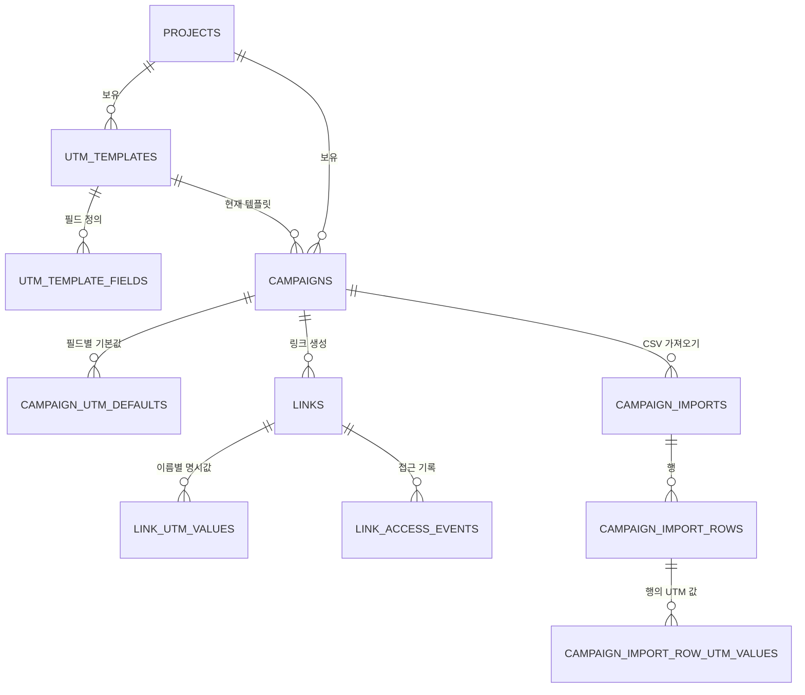

# 캠페인 UTM 템플릿 구조

## 1. 문서 지위

이 문서는 로그인·프로젝트·캠페인 확장 계획의 5단계 중 UTM과 CSV 구조에 대한 최신 결정이다.

다음 문서의 고정 UTM 컬럼과 고정 CSV UTM 헤더 설명이 이 문서와 다르면 이 문서를 우선한다.

- `docs/architecture/project_campaign_personalized_links.md`
- `docs/implement/03_authenticated_projects_campaigns.md`
- `docs/implement/05_implementation_checklist.md`

기존 익명 링크, 프로젝트, 인증, API key와 도메인 계약은 기존 문서를 그대로 따른다.

## 2. 목표

- 프로젝트 안에서 UTM 필드 구성을 템플릿으로 재사용한다.
- 캠페인은 현재 사용할 UTM 템플릿과 필드별 기본값을 가진다.
- 링크·캠페인 기본값·CSV 행은 UTM 값을 필드 이름으로 보존한다.
- CSV 양식은 캠페인이 현재 선택한 템플릿의 활성 필드로 생성한다.
- 현재 캠페인 템플릿의 활성 필드만 리다이렉트와 통계에 사용한다.
- 성공한 리다이렉트의 최종 UTM은 접근 이벤트 JSONB에 스냅샷한다.

## 3. 관계



## 4. 테이블

### 4.1 `utm_templates`

```text
id
project_id
name
deleted_at nullable
created_at
updated_at
```

- 템플릿은 전역 공유하지 않고 프로젝트가 소유한다.
- 다른 프로젝트의 캠페인과 링크가 템플릿을 사용할 수 없게 복합 FK로 보호한다.
- 삭제는 soft delete다.

권장 제약:

```text
UNIQUE (id, project_id)
UNIQUE (project_id, name) WHERE deleted_at IS NULL
```

### 4.2 `utm_template_fields`

```text
id
utm_template_id
name
deleted_at nullable
created_at
```

- 활성 필드는 템플릿당 최대 10개다.
- `position`은 두지 않는다.
- 필드 `id`는 템플릿 관리용이며 링크 값과 통계의 식별자는 `name`이다.
- 활성 필드 이름은 한 템플릿 안에서 unique다.
- 삭제는 soft delete하고 같은 이름을 다시 추가할 수 있다.

권장 제약:

```text
UNIQUE (id, utm_template_id)
UNIQUE (utm_template_id, name) WHERE deleted_at IS NULL
```

최대 10개 제한은 템플릿 행을 잠근 트랜잭션에서 활성 필드 수를 검사하여 동시 추가에도 적용한다.

### 4.3 `campaigns` 변경

기존 캠페인 필드에 다음 참조를 둔다.

```text
utm_template_id nullable
```

- UTM을 사용하지 않는 캠페인을 허용한다.
- 캠페인의 템플릿 변경·해제는 기존 링크에도 즉시 적용한다.
- 캠페인과 템플릿은 같은 프로젝트에 속해야 한다.

권장 제약:

```text
UNIQUE (id, project_id)
UNIQUE (id, utm_template_id)
FOREIGN KEY (utm_template_id, project_id)
    REFERENCES utm_templates (id, project_id)
```

### 4.4 `campaign_utm_defaults`

```text
campaign_id
field_name
default_value
```

- 템플릿은 필드 정의를 공유하고 기본값은 캠페인별로 저장한다.
- 값이 없는 필드는 행을 만들지 않으며 비활성 이름의 값도 보존한다.
- 링크에 값이 없는 필드는 리다이렉트 시 현재 캠페인 기본값을 사용한다.
- 기본값 변경은 값을 직접 지정하지 않은 기존 링크에도 즉시 반영한다.

권장 제약:

```text
PRIMARY KEY (campaign_id, field_name)
```

### 4.5 `links` 변경

```text
campaign_id nullable
utm_template_id nullable
external_id nullable
```

- `utm_template_id`는 생성 당시 입력·CSV 추적용 참조이며 리다이렉트 활성 필드는 현재 캠페인 템플릿이 결정한다.
- `external_id`는 사용자가 외부 데이터와 링크를 연결하려고 직접 넣는 선택적 식별자다.
- `external_id`는 캠페인 안에서 unique이며 개인정보를 넣지 않게 안내한다.
- 캠페인 없는 독립 프로젝트 링크에는 UTM 템플릿과 값을 두지 않는다.
- `link_utm_values`에는 링크 생성 요청에서 직접 지정한 값만 저장하며 캠페인 기본값은 복사하지 않는다.

권장 제약:

```text
UNIQUE (id, utm_template_id)
UNIQUE (campaign_id, external_id)
    WHERE campaign_id IS NOT NULL AND external_id IS NOT NULL
FOREIGN KEY (campaign_id, project_id)
    REFERENCES campaigns (id, project_id)
FOREIGN KEY (utm_template_id, project_id)
    REFERENCES utm_templates (id, project_id)
```

### 4.6 `link_utm_values`

```text
link_id
field_name
value
```

- 링크 생성 요청에서 직접 지정한 값만 저장한다.
- 값이 없으면 행을 만들지 않는다.
- 템플릿에서 비활성화된 이름도 보존하고 같은 이름이 다시 활성화되면 재사용한다.

권장 제약:

```text
PRIMARY KEY (link_id, field_name)
```

### 4.7 CSV import

CSV 원문을 JSONB나 배열로 저장하지 않는다.

```text
campaign_imports
- id
- campaign_id
- utm_template_id
- status
- idempotency 정보
- 진행 수와 lease 정보
- 생성·완료 시각

campaign_import_rows
- id
- import_id
- row_number
- original_url nullable
- external_id
- status
- link_id nullable
- error_code nullable
- error_message nullable

campaign_import_row_utm_values
- import_row_id
- field_name
- value
```

- import 접수 시 헤더를 활성 템플릿 필드 이름과 대조한다.
- 접수된 행은 당시 헤더 이름과 값을 저장한다.
- 접수 후 캠페인 템플릿이 변경되거나 필드가 삭제돼도 저장된 이름과 값으로 작업을 계속한다.
- 오류 CSV는 원래 헤더와 행 번호, 안정적인 오류 code와 설명을 포함한다.

## 5. 템플릿과 필드 변경

### 5.1 추가

- 새 필드 행을 추가한다.
- 해당 템플릿을 사용하는 모든 캠페인의 양식·리다이렉트·통계에 즉시 반영한다.
- 과거 이벤트에 해당 이름이 없으면 통계에서 `(없음)`으로 집계한다.

### 5.2 삭제

- `utm_template_fields.deleted_at`을 기록한다.
- 양식, 리다이렉트와 통계에서 즉시 제외한다.
- 기존 링크와 import 행의 값은 유지한다.
- 같은 이름을 다시 추가하면 보존한 값과 과거 통계를 다시 사용한다.
- 삭제된 필드는 활성 필드 최대 10개 계산에서 제외한다.

### 5.3 이름 변경

UTM 필드 이름은 실제 query parameter 이름이므로 같은 행의 이름을 덮어쓰지 않는다.

```text
기존 필드 soft delete
→ 새 이름으로 새 필드 생성
```

- 기존 이름의 값은 보존하지만 현재 리다이렉트와 통계에서는 제외한다.
- 새 이름은 별도 이름으로 취급하며 과거 이벤트에는 값이 없으므로 `(없음)`이다.

### 5.4 기본값 변경

- `campaign_utm_defaults`만 변경한다.
- 링크에 명시값이 없으면 다음 리다이렉트부터 새 기본값을 동적으로 사용한다.

## 6. CSV 양식

고정 헤더는 다음 두 개다.

```text
original_url,external_id
```

그 뒤에 현재 캠페인이 선택한 템플릿의 활성 필드 이름을 추가한다.

```csv
original_url,external_id,utm_medium,utm_partner,utm_source
https://example.com/event,customer-001,email,naver,newsletter
```

- 양식은 캠페인 화면에서 다운로드한다.
- `original_url` 셀이 비어 있으면 링크 자체 목적지를 저장하지 않고 리다이렉트 시 현재 캠페인 기본 목적지를 사용한다.
- 링크 자체 목적지와 현재 캠페인 기본 목적지가 모두 없으면 해당 링크는 `410 Gone`을 반환한다.
- 필드 위치에는 의미가 없으며 업로드는 헤더 이름으로 매핑한다.
- 출력은 활성 필드 이름 오름차순을 사용하고 DB에 위치를 저장하지 않는다.
- UTF-8과 UTF-8 BOM을 허용한다.
- 최대 파일 크기는 10MB, 최대 데이터 행은 10,000개다.
- 프로젝트당 동시에 처리하는 CSV import는 하나다.

## 7. 링크 생성과 리다이렉트

UI 단일 생성, 공개 단일 API, JSON batch와 CSV worker는 같은 링크 생성 유스케이스를 호출한다.

링크 생성 시:

1. 캠페인과 현재 템플릿의 프로젝트 소유권을 확인한다.
2. 요청 UTM 이름을 활성 템플릿 필드와 매핑한다.
3. 요청에 명시된 이름과 값만 `link_utm_values`에 저장한다.
4. URL 형식과 내부 주소 차단 정책을 검증한 뒤 저장한다. 인증된 프로젝트 멤버와 API key가 만든 링크는 생성·리다이렉트 위험 검사를 생략한다.

리다이렉트 시:

1. 기존 Host와 code 규칙으로 링크를 찾는다.
2. 링크 자체 목적지가 없으면 현재 캠페인 기본 목적지를 읽고, 둘 다 없으면 `410 Gone`을 반환한다.
3. 현재 캠페인 템플릿의 활성 이름마다 링크 명시값, 캠페인 기본값 순으로 최종 UTM을 만든다.
4. 기존 query를 보존하되 같은 이름은 최종 UTM 값으로 덮어쓴다.
5. 성공한 리다이렉트의 최종 UTM을 접근 이벤트에 저장하고 fragment를 보존한다.

캠페인을 삭제하면 캠페인과 소속 링크를 함께 soft delete하고 기존 주소는 `410 Gone`을 반환한다. 진행 중인 import도 새 링크를 만들지 않게 중단한다.

## 8. 통계

- `link_access_events.effective_utm` JSONB에 리다이렉트 당시 최종 이름·값을 저장한다.
- 현재 캠페인 템플릿의 활성 이름만 `REDIRECTED` 이벤트에서 집계한다.
- 필드가 이벤트 생성 뒤 추가됐다면 해당 이벤트는 그 필드의 `(없음)` 값으로 집계한다.
- 만료 접근은 `EXPIRED`로 일반 접근 통계에 포함하지만 UTM 통계에서는 제외한다.
- 삭제 링크의 과거 이벤트는 모든 통계에서 제외한다.
- 일별 사전 집계는 실제 JSONB 집계가 느려질 때 추가한다.

## 9. 이미 확정된 운영 한도

```text
JSON batch                 요청당 최대 500개
CSV                        최대 10,000행, 10MB
CSV 동시 실행              프로젝트당 1개
익명 링크 생성             IP당 분당 10회, 일 200회
API key 조회               key당 분당 300회
API key 링크 생성          key당 분당 60회
JSON batch                 프로젝트당 분당 2회
CSV upload                 프로젝트당 시간당 5회
대량 링크 생성             프로젝트당 일 50,000개
```

- 초과 응답은 `429 Too Many Requests`와 `Retry-After`를 사용한다.
- rate limit과 quota는 Redis를 사용한다.
- CSV import 작업, 행, 오류와 idempotency는 PostgreSQL을 사용한다.
- 별도 message broker는 추가하지 않는다.

## 10. 구현 전에 남은 결정

다음 사항은 구현 질문 게이트에서 한 번에 확정한다.

- 허용할 UTM 필드 이름 형식과 최대 길이
- UTM 값과 템플릿·캠페인 이름·설명의 최대 길이
- 공개 API와 JWT 웹 API의 템플릿·캠페인·CSV endpoint 계약
- JSON 단일·batch 요청에서 동적 UTM 값을 표현할 schema
- 캠페인 기본값을 요청에서 명시적으로 비우는 방법
- batch와 CSV의 `Idempotency-Key` 필수 여부와 actor별 scope
- CSV 구조 오류와 행 오류의 전체 거절·부분 성공 경계
- import 원본 행·오류 자료의 보관 기간과 링크 export 필터
- worker lease 시간, 재시도 횟수와 실패 상태
- 공유 Redis 장애 시 fail-open 여부, 환경별 key prefix와 IP 개인정보 처리
- 사용 중인 UTM 템플릿 자체를 삭제할 수 있는지와 삭제 후 캠페인 동작
