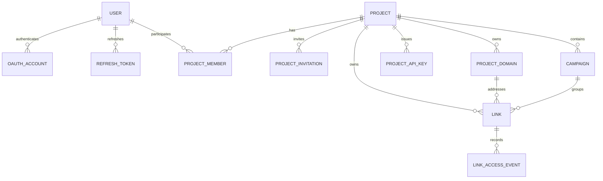

# 프로젝트·캠페인·개인화 단축 URL 확장 계획

## 1. 문서 목적

현재 srrrg는 비로그인 사용자가 단일 단축 URL을 생성하고, 생성 시 발급된 secret key로 링크를 관리한다.

향후에는 다음 사용 방식을 함께 지원한다.

- 비로그인 사용자의 빠른 단일 링크 생성
- 로그인 사용자의 프로젝트별 단일 링크 관리
- 프로젝트별 캠페인 생성
- 캠페인 안에서 UTM과 외부 식별자가 다른 개인화 링크 대량 생성
- 프로젝트별 서브도메인, 커스텀 도메인, API key 관리
- 링크·캠페인·프로젝트 단위 통계

핵심 원칙은 단일 링크를 가짜 캠페인으로 만들지 않는 것이다. 캠페인은 실제로 여러 링크를 묶어 관리할 때만 생성하고, 단일 링크와 캠페인을 함께 보는 상위 단위는 프로젝트로 둔다.

## 2. 목표 구조



링크는 다음 세 형태로 존재한다.

| 형태 | 프로젝트 | 캠페인 | 관리 권한 |
|---|---|---|---|
| 비로그인 단일 링크 | 없음 | 없음 | 링크별 secret key |
| 프로젝트 단일 링크 | 있음 | 없음 | 로그인 사용자 또는 프로젝트 API key |
| 캠페인 링크 | 있음 | 있음 | 로그인 사용자 또는 프로젝트 API key |

프로젝트 화면은 프로젝트 단일 링크와 캠페인을 함께 보여준다. 캠페인 목록은 캠페인만 반환하고, 캠페인 상세에서 해당 캠페인의 링크를 조회한다.

### 2.1 모듈 구조 원칙

현재는 하나의 Gradle 모듈로 배포하는 modular monolith를 유지한다. 기능 경계는 패키지로 나누되 독립 배포 필요가 실제로 생기면 해당 경계를 기준으로 서비스를 분리한다.

```text
link.srrrg
├── link          기존 익명 링크, 프로젝트 링크, 리다이렉트
├── identity      사용자와 OAuth 계정 연결
├── auth          OAuth callback, JWT, 현재 요청 인증 주체
├── project       프로젝트, 멤버, 초대, API key
├── domain        플랫폼·커스텀 도메인과 인증서 활성화
├── campaign      캠페인, UTM, CSV import
├── statistics    링크·캠페인·프로젝트 통계 조회
└── common        여러 기능이 실제로 공유하는 HTTP·설정 코드만
```

- 도메인과 서비스 메서드가 Spring Security의 JWT 객체나 cert-manager 타입을 직접 받지 않게 한다.
- JWT와 API key 인증 결과는 작은 내부 인증 주체 값으로 변환하고, 프로젝트 권한은 최신 멤버십을 DB에서 확인한다.
- DNS 조회와 인증서 발급처럼 외부 구현이 바뀔 가능성이 높은 경계만 교체 가능한 adapter로 둔다.
- JPA repository, service, controller마다 일률적으로 interface를 만들지 않는다.
- 기존 `link` 패키지를 먼저 이동하거나 다시 작성하지 않고 필요한 관계만 점진적으로 추가한다.
- 순환 의존이 생기면 공통 패키지로 옮겨 숨기지 말고 호출 방향과 유스케이스 소유 기능을 다시 정한다.

## 3. 도메인별 역할

### 3.1 사용자

사용자는 로그인 계정이다. 초기 로그인 공급자는 Google, Kakao, GitHub 세 개로 제한하고 자체 비밀번호 로그인은 만들지 않는다. 애플리케이션 내부 사용자 PK와 공급자별 고유 식별자를 분리하여 한 사용자가 나중에 다른 로그인 공급자를 연결할 수 있게 한다.

- 웹 로그인은 OAuth2 로그인 성공 후 srrrg가 발급한 자체 JWT를 사용하며 서버 세션은 사용하지 않는다.
- access JWT는 짧게 유지하고 HttpOnly·Secure cookie로 전달한다. refresh token도 cookie로 전달하되 hash와 폐기 상태는 DB에 저장하고 매 사용 시 교체한다.
- 공급자가 반환한 이메일만으로 계정을 자동 병합하지 않는다. 동일한 이메일의 기존 사용자가 있으면 기존 로그인 방식으로 본인을 확인한 뒤 새 OAuth 계정을 연결한다.
- 이메일 제공 동의 여부와 관계없이 공급자의 고유 subject로 사용자를 식별한다.
- 첫 로그인 시 사용자가 바로 링크를 관리할 수 있도록 기본 개인 프로젝트 하나를 만든다.
- OAuth client secret은 환경 변수나 배포 secret으로 주입하고 DB와 저장소에 저장하지 않는다.

사용자는 직접 링크를 소유하지 않고 프로젝트 멤버십을 통해 로그인 링크를 관리한다. 비로그인 링크는 기존처럼 사용자나 프로젝트 없이 존재할 수 있다.

### 3.2 프로젝트

프로젝트는 로그인 기능의 관리·권한·설정 경계다.

프로젝트가 담당하는 범위는 다음과 같다.

- 프로젝트 단일 링크와 캠페인 목록
- 참여 사용자와 역할
- 기본 서브도메인 또는 커스텀 도메인
- 자동화용 API key
- 프로젝트 전체 통계

프로젝트를 만들 때 생성자를 `OWNER` 멤버로 함께 저장한다.

### 3.3 프로젝트 멤버

초기 역할은 필요한 세 가지로 제한한다.

| 역할 | 권한 |
|---|---|
| `OWNER` | 프로젝트 설정, 멤버, 도메인, API key, 캠페인, 링크 관리 |
| `EDITOR` | 캠페인과 링크 생성·수정·삭제 |
| `VIEWER` | 프로젝트, 링크, 캠페인, 통계 조회 |

프로젝트에는 최소 한 명의 `OWNER`가 남아 있어야 한다. 마지막 OWNER 탈퇴·강등은 차단한다.

가입 여부와 관계없이 이메일로 프로젝트에 초대할 수 있다. 초대 token 원문은 이메일에서만 전달하고 DB에는 hash를 저장하며, 만료·취소·재발송·수락 상태를 관리한다.

### 3.4 캠페인

캠페인은 동일한 목적의 링크들을 묶는 관리·통계 단위다.

- 캠페인은 반드시 하나의 프로젝트에 속한다.
- 캠페인은 이름, 설명, 기본 목적지 URL과 기본 UTM 값을 가질 수 있다.
- 캠페인 기본값은 링크 생성 시 복사한다.
- 캠페인 기본값을 바꿔도 이미 생성된 링크의 목적지와 UTM은 바뀌지 않는다.
- 캠페인 삭제는 통계 보존을 위해 물리 삭제 대신 보관 처리한다.

### 3.5 링크

링크는 항상 단축 코드 하나와 최종 목적지 설정 하나를 나타낸다.

- 프로젝트가 없는 링크는 익명 링크이며 secret key가 필요하다.
- 로그인 상태에서 생성한 링크는 반드시 프로젝트에 속한다.
- 캠페인 소속은 선택 사항이다.
- 캠페인 링크의 프로젝트는 캠페인의 프로젝트와 같아야 한다.
- 캠페인 또는 프로젝트 간 링크 이동은 지원하지 않는다. 다른 분류가 필요하면 새 링크를 만든다.
- UTM 값은 생성 후 변경하지 않는다. 변경이 필요하면 새 링크를 만든다.

프로젝트·캠페인·UTM을 불변으로 두면 과거 접근 이벤트를 현재 링크 설정으로 잘못 재분류하는 문제를 피할 수 있다.

## 4. 데이터베이스 변경

기존 Flyway migration은 수정하지 않고 V11 이후 신규 migration으로 추가한다.

### 4.1 users, oauth_accounts와 refresh_tokens

```text
users
id
email nullable          정규화된 대표 이메일, verified email만 unique 적용
email_verified_at nullable
display_name
created_at
updated_at

oauth_accounts
id
user_id
provider                GOOGLE, KAKAO, GITHUB
provider_user_id        공급자가 보장하는 사용자 고유 식별자, 일반적으로 sub
provider_email nullable 마지막 로그인에서 받은 이메일
provider_email_verified
created_at
last_login_at

refresh_tokens
id
user_id
token_hash
token_family_id
expires_at
used_at nullable
revoked_at nullable
replaced_by_token_id nullable
created_at
```

- `(provider, provider_user_id)`를 unique로 둔다.
- 처음 보는 OAuth 계정의 verified email과 같은 사용자가 없으면 `users`, `oauth_accounts`, 기본 프로젝트와 OWNER 멤버십을 생성한다.
- 같은 verified email의 사용자가 있으면 새 사용자를 만들거나 자동 병합하지 않고 기존 로그인으로 본인 확인한 뒤 `oauth_accounts`만 연결한다.
- 공급자 email은 계정을 찾는 힌트이며 로그인 식별자는 `(provider, provider_user_id)`다.
- refresh token 원문은 저장하지 않고 rotation과 재사용 탐지에 필요한 최소 상태만 유지한다.
- 공급자별 SDK나 별도 어댑터 계층을 만들지 않고 Spring Security OAuth2 Client 설정을 사용한다. Google과 GitHub는 기본 provider 설정을 활용하고 Kakao에 필요한 endpoint만 설정한다.

### 4.2 projects

```text
id
name
slug                    사용자 화면과 API에서 사용할 프로젝트 식별자
created_by_user_id
created_at
updated_at
archived_at nullable
```

`slug`는 프로젝트 소유권을 판단하는 값이 아니며 모든 요청에서 멤버십을 별도로 확인한다.

### 4.3 project_members

```text
project_id
user_id
role                    OWNER, EDITOR, VIEWER
created_at
```

- PK 또는 unique: `(project_id, user_id)`
- 프로젝트와 사용자를 FK로 참조한다.
- 프로젝트 생성자는 같은 트랜잭션에서 OWNER로 추가한다.

#### project_invitations

```text
id
project_id
email                   정규화된 초대 대상 이메일
role                    EDITOR, VIEWER
token_hash
invited_by_user_id
expires_at
accepted_at nullable
revoked_at nullable
created_at
```

- OWNER 초대는 기존 OWNER가 멤버 추가 후 승격하는 방식으로 제한한다.
- 동일 프로젝트와 이메일에는 활성 초대 하나만 허용한다.
- 초대 수락은 token 검증 후 현재 로그인 사용자에게 멤버십을 생성한다.
- 원문 token은 이메일 링크에서만 전달하고 로그와 DB에 저장하지 않는다.

### 4.4 project_domains

```text
id
project_id
hostname                lower-case 정규화된 전체 host
kind                    PLATFORM_SUBDOMAIN, CUSTOM
status                  PENDING, VERIFIED, CERT_ISSUING, ACTIVE, FAILED
cname_target            nullable, CUSTOM 도메인에 발급한 전용 CNAME 목적지
verified_at nullable
primary_domain
created_at
```

- `hostname`은 전체 서비스에서 unique다.
- 프로젝트당 primary domain은 하나만 허용한다.
- 플랫폼 서브도메인과 커스텀 도메인을 같은 테이블에서 관리한다.
- 커스텀 도메인에는 `<random>.cname.srrrg.link` 형식의 전용 CNAME 목적지를 발급한다.
- CNAME 목적지는 공개 단축 URL이 아니라 DNS 연결과 프로젝트 귀속 검증에만 사용한다.
- CNAME 확인과 TLS 인증서 발급이 모두 끝난 `ACTIVE` 도메인만 링크에 사용할 수 있다.
- 프로젝트는 여러 도메인을 가질 수 있지만 primary domain은 하나만 둔다.
- 링크 생성 시 플랫폼 서브도메인 또는 커스텀 도메인 하나를 선택하고 해당 도메인에서만 링크를 연다.

프로젝트 링크는 `(domain_id, code)` 조합으로 식별한다. 같은 code라도 도메인이 다르면 서로 다른 링크가 될 수 있으며, CNAME 목적지나 다른 프로젝트 도메인을 같은 링크의 별칭으로 제공하지 않는다.

#### 커스텀 도메인 등록과 활성화

예를 들어 사용자가 `go.acme.com`을 등록하면 다음 순서로 처리한다.

1. `project_domains`에 `PENDING` 상태로 저장한다.
2. 추측하기 어려운 전용 CNAME 목적지 `d7k29fx4.cname.srrrg.link`를 발급한다.
3. 사용자에게 아래 DNS 레코드 하나를 설정하도록 안내한다.

   ```dns
   go.acme.com CNAME d7k29fx4.cname.srrrg.link
   ```

4. srrrg가 `go.acme.com`의 CNAME을 조회하여 발급한 목적지와 정확히 일치하는지 확인한다.
5. 일치하면 해당 사용자가 DNS를 제어할 수 있다고 판단하고 상태를 `VERIFIED`로 바꾼다.
6. cert-manager가 Let's Encrypt에 `go.acme.com` 인증서를 요청하고 상태를 `CERT_ISSUING`으로 바꾼다.
7. Let's Encrypt의 HTTP-01 검증과 인증서 적용이 끝나면 `ACTIVE`로 바꾼다.

srrrg DNS에는 `*.cname.srrrg.link`가 서비스 Ingress를 가리키도록 미리 설정한다. 따라서 사용자 CNAME은 검증 후에도 그대로 트래픽 연결에 사용된다.

```text
go.acme.com
→ d7k29fx4.cname.srrrg.link
→ srrrg Ingress
```

CNAME은 브라우저 주소를 변경하는 리다이렉트가 아니다. 방문자가 `https://go.acme.com/summer`에 접속하면 주소와 HTTP Host는 계속 `go.acme.com`이며, `d7k29fx4.cname.srrrg.link/summer`를 공개 링크 별칭으로 제공하지 않는다.

전용 CNAME 확인과 Let's Encrypt 확인의 목적은 다르다.

```text
전용 CNAME 확인
→ 이 도메인을 현재 프로젝트에 연결한 사용자가 DNS를 제어하는지 확인

Let's Encrypt HTTP-01 확인
→ srrrg 서버가 이 도메인의 TLS 인증서를 받을 수 있는지 확인
```

사용자가 수행할 작업은 CNAME 레코드 하나를 설정하는 것뿐이다. DNS 전파가 늦으면 `PENDING` 상태에서 다시 확인할 수 있게 하고, 인증서 발급 실패 시 `FAILED` 상태와 실패 원인을 보여준다.

### 4.5 project_api_keys

```text
id
project_id
name
key_prefix              목록에서 키를 식별할 공개 접두사
key_hash                원문이 아닌 해시
scopes                  허용 작업 목록
created_by_user_id
created_at
last_used_at nullable
expires_at nullable
revoked_at nullable
```

API key 원문은 생성 응답에서 한 번만 반환한다. 로그와 DB에는 원문을 저장하지 않는다.

key는 `srrrg_pk_<public-prefix>_<secret>`처럼 로그에서 식별 가능한 공개 접두사와 충분히 긴 비밀값으로 구성한다. 난수 생성은 기존 `SecureRandomStringGenerator`를 재사용한다. API key는 충분한 entropy를 가진 임의값이므로 요청마다 느린 BCrypt 비교를 하지 않고 SHA-256 hash로 저장·조회한다.

초기 scope는 다음으로 제한한다.

```text
links:read
links:write
campaigns:read
campaigns:write
stats:read
```

### 4.6 campaigns

```text
id
project_id
name
description nullable
default_original_url nullable
default_utm_source nullable
default_utm_medium nullable
default_utm_campaign nullable
default_utm_term nullable
default_utm_content nullable
created_by_user_id
created_at
updated_at
archived_at nullable
```

### 4.7 links 변경

기존 `links` 테이블에 다음 컬럼을 추가한다.

```text
project_id nullable
domain_id nullable
campaign_id nullable
created_by_user_id nullable
external_id nullable
utm_source nullable
utm_medium nullable
utm_campaign nullable
utm_term nullable
utm_content nullable
```

프로젝트 링크에는 per-link secret key가 없으므로 기존 `secret_key_hash NOT NULL` 제약을 신규 migration에서 nullable로 변경하고, `Link` 엔티티의 `nullable = false` 설정도 함께 보정한다. 기존 익명 링크의 secret hash 값은 그대로 유지한다.

`external_id`는 대량 생성 요청자가 수신자나 외부 시스템의 레코드와 링크를 다시 연결하기 위한 값이다. 이메일, 전화번호, 이름 같은 개인정보 대신 외부에 노출돼도 의미를 알 수 없는 식별자를 사용한다.

권장 제약은 다음과 같다.

- 익명 링크: `project_id IS NULL`, `domain_id IS NULL`, `campaign_id IS NULL`, `secret_key_hash IS NOT NULL`
- 프로젝트 링크: `project_id IS NOT NULL`, `domain_id IS NOT NULL`, `secret_key_hash IS NULL`
- 프로젝트 링크의 프로젝트와 선택한 도메인의 프로젝트가 같아야 한다.
- 캠페인 링크: `campaign_id IS NOT NULL`이면 `project_id IS NOT NULL`
- 캠페인 링크의 프로젝트와 캠페인의 프로젝트가 같아야 한다.
- 기존 전역 `links.code` unique 제약은 신규 migration에서 제거한다.
- 익명 링크에는 `UNIQUE (code) WHERE project_id IS NULL` partial unique index를 둔다.
- 프로젝트 링크에는 `UNIQUE (domain_id, code) WHERE domain_id IS NOT NULL` partial unique index를 둔다.
- `(campaign_id, external_id)`는 `external_id`가 있을 때 unique다.
- `project_id`, `domain_id`, `campaign_id`에 목록·라우팅·집계용 인덱스를 추가한다.

기존 익명 링크는 `project_id`, `domain_id`, `campaign_id`, `created_by_user_id`가 모두 null인 상태로 유지한다.

### 4.8 기존 link_access_events

현재 이벤트 테이블은 `link_id`를 가지고 있으므로 구조를 유지한다.

```text
링크 통계      link_access_events.link_id
캠페인 통계    link_access_events → links.campaign_id
프로젝트 통계  link_access_events → links.project_id
```

프로젝트, 캠페인, UTM을 링크 생성 후 변경하지 않으므로 이벤트에 같은 값을 중복 저장하지 않는다.

## 5. UTM과 목적지 URL 규칙

UTM 사용 여부와 캠페인 소속 여부는 독립적이다.

지원해야 하는 조합은 다음과 같다.

```text
익명 단일 링크 + UTM 없음
익명 단일 링크 + UTM 있음
프로젝트 단일 링크 + UTM 없음
프로젝트 단일 링크 + UTM 있음
캠페인 링크 + 공통 UTM
캠페인 링크 + 개인별 UTM
```

목적지 생성 규칙은 하나의 공용 로직으로 처리한다.

1. `original_url`의 기존 query parameter를 읽는다.
2. 저장된 UTM 필드가 있으면 동일한 이름의 기존 UTM 값을 덮어쓴다.
3. 비 UTM query parameter는 유지한다.
4. 모든 이름과 값을 URL encoding한다.
5. fragment가 있으면 query 뒤에 유지한다.

UTM에는 이름, 이메일, 전화번호 등 직접 식별 가능한 개인정보를 넣지 않는다.

## 6. 인증과 권한

### 6.1 익명 링크

- 기존 `code + X-Srrrg-Secret-Key` 방식을 유지한다.
- 익명 링크는 캠페인, 프로젝트 도메인, 프로젝트 API key를 사용할 수 없다.

### 6.2 로그인 사용자

- 로그인 화면에는 Google, Kakao, GitHub 버튼만 제공한다.
- OAuth callback과 state 검증은 Spring Security에 맡기고, 성공 후 공급자 token이 아닌 srrrg 자체 access JWT와 refresh token을 발급한다.
- access JWT는 `HttpOnly`, `Secure`, `SameSite=Lax` cookie로 전달하고 기본 유효기간을 15분으로 둔다.
- refresh token은 별도 `HttpOnly`, `Secure`, `SameSite=Lax` cookie로 전달하고 기본 유효기간을 30일로 둔다.
- refresh token은 사용할 때마다 교체하고 이전 token 재사용이 감지되면 같은 token family를 모두 폐기한다.
- 로그아웃 시 refresh token을 즉시 폐기한다. 이미 발급된 access JWT는 denylist를 만들지 않고 최대 15분 뒤 만료되게 한다.
- cookie 인증의 상태 변경 요청에는 CSRF 보호를 유지한다.
- access JWT에는 사용자 식별에 필요한 최소 claim만 넣고 프로젝트 역할과 scope는 넣지 않는다. 프로젝트 권한은 요청 시 최신 멤버십으로 확인한다.
- 사용자 인증 후 프로젝트 멤버십과 역할을 검사한다.
- 단순히 `project_id`를 전달받았다는 이유로 접근을 허용하지 않는다.
- 링크와 캠페인 조회에서도 소속 프로젝트 권한을 확인한다.
- 로그인하지 않은 사용자의 현재 링크 생성·관리·리다이렉트 경로는 계속 허용한다.

### 6.3 프로젝트 API key

- API key hash를 검증한 뒤 프로젝트와 scope를 확인한다.
- API key는 발급된 프로젝트 밖의 리소스에 접근할 수 없다.
- 폐기·만료 key는 즉시 거절한다.
- 공개 API에서는 `Authorization: Bearer <api-key>` 헤더로 전달한다.
- 브라우저 JWT와 API key 인증을 섞지 않는다. srrrg 웹은 JWT cookie를, 외부 자동화는 API key를 사용한다.
- 기존 익명 링크의 `X-Srrrg-Secret-Key`는 해당 링크 하나를 관리하는 값으로 유지하며 프로젝트 API key로 취급하지 않는다.
- 별도의 복잡한 rotation 절차 대신 새 key를 발급하고 기존 key를 폐기하는 방식을 사용한다.

### 6.4 익명 링크 귀속

로그인 사용자는 secret key로 기존 익명 링크를 자신이 속한 프로젝트에 귀속할 수 있다.

```http
POST /api/web/projects/{projectId}/links/{code}/claim
X-Srrrg-Secret-Key: srrrg_sk_xxxxxxxxx
```

성공 시 같은 트랜잭션에서 다음을 처리한다.

```text
project_id = 대상 프로젝트
created_by_user_id = 현재 사용자
secret_key_hash = null
```

귀속 후에는 기존 secret key를 무효화한다.

## 7. API 변경 방향

현재 `/api/links` 익명 링크 API는 경로와 요청·응답을 그대로 유지한다. 로그인 웹 화면의 JSON endpoint는 `/api/web`에서 JWT cookie만 사용하고, 외부 자동화 API는 `/api/v1`에서 프로젝트 API key만 사용한다. 두 HTTP adapter는 같은 application service를 호출하며 업무 규칙을 복제하지 않는다.

정확한 요청·응답 DTO는 구현과 함께 OpenAPI 명세로 확정한다. 문서의 endpoint 목록과 실제 코드를 따로 관리하지 않고 springdoc가 생성하는 OpenAPI를 단일 계약으로 사용한다.

### 7.1 프로젝트와 멤버

```text
POST   /api/web/projects
GET    /api/web/projects
GET    /api/web/projects/{projectId}
PATCH  /api/web/projects/{projectId}
GET    /api/web/projects/{projectId}/overview

GET    /api/web/projects/{projectId}/members
POST   /api/web/projects/{projectId}/invitations
DELETE /api/web/projects/{projectId}/invitations/{invitationId}
PATCH  /api/web/projects/{projectId}/members/{userId}
DELETE /api/web/projects/{projectId}/members/{userId}
```

프로젝트 생성과 멤버 관리는 웹 JWT 인증 전용이다. 프로젝트 API key로 새 프로젝트를 만들거나 멤버와 OWNER 권한을 변경할 수 없게 한다.

프로젝트 overview는 다음을 분리해 반환한다.

```json
{
  "standaloneLinks": [],
  "campaigns": []
}
```

캠페인 목록에 단일 링크를 가짜 캠페인으로 포함하지 않는다.

### 7.2 프로젝트 도메인

```text
GET    /api/web/projects/{projectId}/domains
POST   /api/web/projects/{projectId}/domains
POST   /api/web/projects/{projectId}/domains/{domainId}/verify
PATCH  /api/web/projects/{projectId}/domains/{domainId}
DELETE /api/web/projects/{projectId}/domains/{domainId}
```

### 7.3 프로젝트 API key

```text
GET    /api/web/projects/{projectId}/api-keys
POST   /api/web/projects/{projectId}/api-keys
DELETE /api/web/projects/{projectId}/api-keys/{keyId}
```

API key 목록·발급·폐기는 로그인한 `OWNER`만 수행한다. 발급된 API key가 다른 API key를 생성하거나 권한을 확대할 수 없게 한다.

### 7.4 캠페인

```text
POST   /api/v1/projects/{projectId}/campaigns
GET    /api/v1/projects/{projectId}/campaigns
GET    /api/v1/campaigns/{campaignId}
PATCH  /api/v1/campaigns/{campaignId}
DELETE /api/v1/campaigns/{campaignId}
```

### 7.5 링크

기존 익명 링크 API는 호환성을 유지한다.

```text
POST   /api/links
GET    /api/links/{code}
PATCH  /api/links/{code}
DELETE /api/links/{code}
```

프로젝트와 캠페인 링크 API를 추가한다.

```text
POST   /api/v1/projects/{projectId}/links
GET    /api/v1/projects/{projectId}/links
POST   /api/v1/campaigns/{campaignId}/links
POST   /api/v1/campaigns/{campaignId}/links/batch
GET    /api/v1/campaigns/{campaignId}/links
```

대량 생성은 페이지 크기와 별개로 요청당 최대 개수를 둔다. 정확한 제한은 성능 측정 후 설정으로 조정하며, 부분 성공 대신 요청 단위 성공·실패를 기본으로 한다.

재시도에 따른 중복 생성을 막기 위해 캠페인 내 `external_id` 중복을 DB 제약으로 차단한다.

#### CSV 가져오기와 내보내기

개인화 링크 대량 작업은 API 호출을 직접 작성하지 않는 사용자도 쓸 수 있도록 CSV를 지원한다.

```text
POST /api/v1/campaigns/{campaignId}/imports/csv
GET  /api/v1/campaigns/{campaignId}/imports/{importId}
GET  /api/v1/campaigns/{campaignId}/imports/{importId}/errors.csv
GET  /api/v1/campaigns/{campaignId}/links.csv
```

첫 버전은 제공된 CSV template의 고정 컬럼만 받는다.

```text
original_url, external_id, utm_source, utm_medium, utm_campaign, utm_term, utm_content
```

- 업로드 직후 형식, 필수값과 중복 `external_id`를 검증한다.
- 처리는 import ID를 반환하는 비동기 작업으로 실행하고 진행 상태와 성공·실패 행 수를 제공한다.
- 실패한 행은 원본 행 번호와 오류 사유가 포함된 CSV로 내려받게 한다.
- 같은 파일 재전송에 대비해 idempotency key를 받는다.
- 초기에는 PostgreSQL에 import 상태를 저장하고 애플리케이션 worker 하나가 처리한다. 별도 message broker는 실제 적체가 확인되기 전에는 추가하지 않는다.
- 자유로운 컬럼 매핑 UI, Excel 파일 직접 지원과 외부 저장소 import는 실제 요청이 생긴 뒤 추가한다.

### 7.6 공개 API 규칙

- 외부에 공개한 프로젝트 API는 프로젝트 API key를 `Authorization: Bearer <api-key>`로 받는다.
- API key에서 프로젝트를 결정하고 URL의 `projectId`가 다르면 거절한다.
- `/api/web/**`는 JWT cookie와 CSRF token만 사용하며 `Authorization` API key를 인증 수단으로 읽지 않는다.
- `/api/v1/**`는 API key만 사용하며 JWT cookie를 인증 수단으로 읽지 않는다.
- 목록은 cursor 기반 페이지네이션으로 시작하고 `limit`에 상한을 둔다.
- 오류 응답은 하나의 Problem Details 형식과 안정적인 오류 code를 사용한다.
- 모든 응답에 요청 추적용 request ID를 제공한다.
- 생성·대량 생성 요청은 재시도 시 중복을 막을 수 있도록 `Idempotency-Key`를 지원한다.
- rate limit 값과 응답 헤더는 실제 운영 한도를 정한 뒤 OpenAPI에 명시한다.

초기 공개 범위는 링크, 캠페인, 통계 조회와 생성·수정에 한정한다. 멤버 초대, OAuth 계정 연결, 운영자 API는 공개 API key 범위에 넣지 않는다.

### 7.7 API 명세 페이지

현재 springdoc, `OpenApiConfig`, controller의 Swagger annotation과 `/v3/api-docs`가 이미 있으므로 이를 버리지 않고 명세 생성에 재사용한다. 현재 홈 화면이 직접 연결하는 원본 Swagger UI는 개발 환경에서만 사용한다.

운영 환경에는 다음 두 주소를 제공한다.

```text
/docs/api       srrrg 디자인을 적용한 공개 API 안내·명세 페이지
/openapi.json   공개 API의 버전 관리된 OpenAPI 문서
```

`/docs/api` 첫 버전은 현재 Thymeleaf 애플리케이션 안에 둔다. 별도의 문서 서비스나 개발자 포털을 만들지 않는다. 페이지에는 다음 내용만 우선 제공한다.

- API key 생성과 `Authorization` 예제
- base URL과 버전 정책
- scope, pagination, idempotency와 rate limit 설명
- 공통 오류 형식과 request ID
- endpoint별 요청·응답과 실행 가능한 curl 예제
- CSV 업로드와 비동기 import 상태 조회 방법

endpoint 표와 schema는 OpenAPI에서 렌더링하고, 인증 안내와 예제만 직접 작성한다. 이렇게 해야 코드와 명세 페이지가 서로 달라지는 것을 막을 수 있다. 공개 OpenAPI에는 API key로 호출할 수 있는 `/api/v1` endpoint와 기존 익명 링크 API만 포함하고 로그인 callback, 웹 JWT 전용 멤버·API key 관리, 내부 화면 API, actuator와 운영자 endpoint는 제외한다.

운영 설정에서는 `/swagger-ui/**` 접근을 막고 홈 화면의 `API 문서 보기` 링크를 `/docs/api`로 변경한다. `/v3/api-docs`는 내부 생성 원본으로 유지하되 공개 사용자는 안정된 `/openapi.json`을 사용하도록 안내한다.

SDK 자동 생성, GraphQL, 별도 API gateway와 다국어 문서 사이트는 실제 요구가 생기기 전에는 만들지 않는다.

### 7.8 기존 기능 호환 원칙

- 비로그인 홈, `/manage`, `POST /api/links`, `X-Srrrg-Secret-Key` 관리와 `/{code}` 리다이렉트를 그대로 유지한다.
- 로그인 기능이 추가되어도 익명 링크 생성을 강제로 로그인 뒤로 옮기지 않는다.
- 기존 Flyway migration과 기존 링크 row를 수정하지 않고 nullable 컬럼과 신규 테이블을 추가한다.
- 기존 익명 API DTO와 상태 code를 한 번에 새 프로젝트 API 형식으로 바꾸지 않는다.
- 새 보안 설정은 기존 공개 경로를 명시적으로 허용하고, 프로젝트 경로에만 웹 JWT 또는 API key 인증을 요구한다.
- 배포 전에 현재 익명 생성·조회·수정·삭제·리다이렉트 회귀 테스트를 통과시킨다.

## 8. 통계 변경 방향

프로젝트와 캠페인의 관계가 확정된 뒤 실제 통계 API를 추가한다. 접근 이벤트 수집 자체는 현재 구현을 유지한다.

### 8.1 집계 단위

- 링크: 단일 링크의 진입·이동·차단·검사 실패
- 캠페인: 캠페인에 속한 전체 링크 합계와 개인화 링크별 비교
- 프로젝트: 프로젝트 단일 링크와 모든 캠페인 링크 합계

### 8.2 제공할 통계

- 기간별 `accessCount`, `redirectCount`, 미이동 수
- 일별 진입·이동 추이
- 결과별 건수: `REDIRECTED`, `BLOCKED`, `CHECK_FAILED`, `URL_CHANGED`
- Referer 도메인별 유입
- 브라우저, OS, 디바이스, 봇 비율
- 최근 활동

초기에는 `link_access_events`를 요청 시 직접 집계한다. 실제 데이터에서 조회 비용 문제가 확인되기 전에는 별도 큐, 실시간 스트림, 집계 서비스, 분석 DB를 추가하지 않는다.

상세 통계를 공개하기 전에 다음 정책을 확정한다.

- 원시 이벤트 보관 기간
- IP 원문 저장 필요 여부와 익명화 방식
- 최근 활동에서 노출할 필드
- 사용자별 통계를 제공할 경우 최소 집계 단위

## 9. 관리 화면 변경

### 9.1 비로그인

- 현재 단축 링크 생성 흐름 유지
- 생성 결과에서 secret key 1회 표시
- code와 secret key로 개별 링크 관리

### 9.2 로그인

- Google, Kakao, GitHub 로그인
- 첫 로그인 시 기본 개인 프로젝트 생성
- 프로젝트 선택 및 생성
- 프로젝트 overview에서 단일 링크와 캠페인 분리 표시
- 프로젝트 멤버, 도메인, API key 설정
- API key 원문 1회 표시, scope와 만료일 선택, 폐기
- 캠페인 생성과 개인화 링크 대량 생성
- 링크·캠페인·프로젝트 통계 전환

현재 관리 화면의 상세 통계는 샘플 데이터다. 프로젝트·캠페인 통계 API가 구현되기 전까지 샘플임을 명확히 표시하고, 누적 카운터는 먼저 실제 API 응답에 연결한다.

## 10. 구현 단계

### 공통 구현 원칙

#### 구현 전 질문 게이트

- 각 단계 구현을 시작하기 전에 `docs/conventions.md`, 이 설계 문서, `docs/implement/01_create_link_api.md`, `docs/implement/02_manage_link_api.md`와 새 구현 명세서를 처음부터 끝까지 읽는다. UI를 변경하면 `docs/design/v2/*`, 성능 경로를 변경하면 관련 `docs/performance/*`도 읽는다.
- 문서와 현재 코드가 다르거나 구현 중 명세에 없는 정책·보안·스키마·API 결정이 발견되면 코드를 작성하기 전에 사용자에게 질문한다. 가장 그럴듯한 기본값으로 임의 보완하지 않는다.
- 각 단계 착수 직전에 남은 결정사항을 모아 사용자에게 한 차례 확인받은 뒤 구현한다.

#### 변경 원칙

- 현재 익명 링크 기능과 URL을 먼저 회귀 테스트로 고정하고 새 기능은 별도 경로와 nullable 컬럼으로 추가한다.
- OAuth 처리는 Spring Security OAuth2 Client, 웹 인증은 자체 JWT cookie, API 명세는 기존 springdoc를 사용한다.
- 공급자별 인증 interface와 구현체, 별도 인증 서비스, API gateway, 문서 전용 애플리케이션을 만들지 않는다.
- 현재 `SecureRandomStringGenerator`, secret hash, 예외 처리와 controller 패턴을 먼저 재사용한다.
- 처음부터 모든 공개 API를 만들지 않고 실제 관리 화면과 자동화에 필요한 endpoint부터 OpenAPI에 공개한다.
- 보안 경계의 검증, 프로젝트 권한 검사, API key hash 저장과 기존 기능 회귀 테스트는 단순화를 이유로 생략하지 않는다.

### 1단계: 로그인과 프로젝트 기반

- 기존 익명 생성·관리·리다이렉트 회귀 테스트 고정
- Spring Security OAuth2 Client와 JWT 발급·검증 추가
- Google, Kakao, GitHub 로그인과 callback 설정
- `users`, `oauth_accounts`, `refresh_tokens`, `projects`, `project_members`, `project_invitations` 추가
- 첫 로그인 시 기본 개인 프로젝트와 OWNER 멤버십 생성
- 이메일 초대, 만료·취소·재발송·수락 구현
- 기존 비로그인 경로 허용과 프로젝트 경로 인증 분리
- 프로젝트 CRUD와 역할별 권한 검사
- 프로젝트 overview와 프로젝트 단일 링크 생성
- 기존 익명 링크 호환 및 프로젝트 귀속

완료 기준: 세 공급자로 로그인할 수 있고, 익명 링크는 로그인 없이 기존 secret key로 계속 관리되며, 로그인 사용자는 기본 프로젝트 안에서 링크를 관리할 수 있다.

### 2단계: API key와 공개 API 문서

- `project_api_keys` 추가
- API key 1회 표시, hash 저장, scope, 만료와 폐기
- 필요한 프로젝트 endpoint를 `/api/v1`로 공개
- Problem Details, request ID, pagination과 idempotency 적용
- 기존 springdoc 명세에서 공개 API만 분리
- Thymeleaf 기반 `/docs/api`와 안정된 `/openapi.json` 제공
- 운영 환경의 원본 Swagger UI 차단과 홈 링크 교체

완료 기준: 프로젝트 API key로 허용된 작업만 수행할 수 있고, 사용자가 Swagger 원본 화면 없이 공개 문서에서 인증 방법과 실제 요청·응답을 확인할 수 있다.

### 3단계: 프로젝트 도메인

- `project_domains` 추가
- 플랫폼 서브도메인 예약·중복 정책
- 프로젝트별 전용 CNAME 발급과 DNS 일치 검증
- cert-manager와 Let's Encrypt HTTP-01을 이용한 인증서 자동 발급
- 프로젝트 primary domain으로 short URL 생성
- k3s Ingress에 `ACTIVE` 커스텀 도메인 연결

완료 기준: 사용자가 CNAME 레코드 하나를 설정하면 검증과 인증서 발급을 거쳐 커스텀 도메인으로 링크를 열 수 있다.

### 4단계: 캠페인과 개인화 링크

- `campaigns`와 링크의 프로젝트·캠페인·UTM 컬럼 추가
- 캠페인 기본값을 적용한 링크 생성
- `external_id` 기반 개인화 링크 대량 생성
- 고정 template 기반 CSV 업로드·오류 CSV·필터된 링크 CSV 내보내기
- PostgreSQL 상태 테이블과 여러 pod에서 중복 실행되지 않는 DB lease 기반 worker를 이용한 비동기 import
- 캠페인과 링크 목록 페이지네이션
- URL query와 UTM 병합 테스트

완료 기준: 하나의 캠페인에서 서로 다른 UTM 또는 외부 식별자를 가진 링크를 안전하게 대량 생성하고 조회할 수 있다.

### 5단계: 실제 통계

- 누적 통계를 실제 관리 화면에 연결
- 링크·캠페인·프로젝트 통계 조회 쿼리
- 기간, 일별 추이, 결과, 유입, 접속 환경 집계 API
- 현재 샘플 통계 교체
- 데이터 증가량과 쿼리 성능 측정

완료 기준: 동일 이벤트를 링크·캠페인·프로젝트 범위에서 일관되게 집계하고, 관리 화면에 실제 데이터가 표시된다.

### 6단계: 필요할 때만 확장

다음 항목은 실제 요구나 성능 문제가 생긴 뒤 추가한다.

- 비밀번호 로그인과 enterprise SSO
- 자동 생성 SDK와 별도 개발자 포털
- 일별 사전 집계 테이블
- 비동기 이벤트 적재
- 별도 분석 저장소
- 팀·조직을 프로젝트 위에 두는 계층
- 결제와 사용량 제한

## 11. 테스트 범위

- 로그인하지 않은 상태에서 기존 홈·관리·익명 API·리다이렉트 동작 유지
- Google, Kakao, GitHub의 `(provider, provider_user_id)` 식별과 중복 차단
- 같은 이메일을 반환한 다른 공급자 계정의 자동 병합 금지
- 기존 로그인 본인 확인 후 새 OAuth 계정 연결
- access JWT 만료, refresh token rotation·재사용 탐지와 로그아웃 폐기
- 익명 링크와 프로젝트 링크의 권한 분리
- secret key가 프로젝트 링크에서 사용되지 않는지 검증
- 익명 링크 귀속 후 기존 secret key 무효화
- OWNER, EDITOR, VIEWER 권한 행렬
- 마지막 OWNER 제거 차단
- 다른 프로젝트 리소스 접근 차단
- 도메인 unique와 미검증 도메인 사용 차단
- API key 원문 미저장, hash 검증, scope, 만료, 폐기와 타 프로젝트 접근 차단
- 운영 환경 Swagger UI 차단과 공개 OpenAPI의 내부 endpoint 제외
- `/docs/api` 예제와 실제 OpenAPI 요청·응답 schema 일치
- 캠페인과 링크의 프로젝트 일치 제약
- 캠페인 내 `external_id` 중복 차단
- UTM 병합, encoding, 기존 query와 fragment 유지
- 대량 생성의 전체 성공·롤백 및 재시도 중복 차단
- CSV 형식·행 번호별 오류·idempotency·import 재시작 검증
- 링크·캠페인·프로젝트 통계 합계 일치

## 12. 구현 전 결정할 항목

다음 항목은 코드 작성 전에 확정해야 한다.

1. 프로젝트 slug의 전체 unique 여부
2. 플랫폼 서브도메인 형식과 예약어
3. API key 기본 만료 기간과 프로젝트별 rate limit
4. 대량 생성 요청의 최대 링크 수
5. 프로젝트·캠페인·UTM 변경 불가 정책의 UI 문구
6. 접근 이벤트 보관 기간과 IP 개인정보 정책
7. JWT 서명 key 형식과 rotation 방법
8. OAuth 공급자가 verified email을 제공하지 않을 때의 가입 정책
9. 프로젝트 초대 메일 발송 서비스와 발신 주소
10. 애플리케이션에서 cert-manager 리소스를 생성할 권한과 배포 방식

이 목록이 전부가 아니다. 구현자가 코드와 기존 문서를 읽으며 새로 발견한 미확정 사항도 구현 전에 질문해야 한다.

## 13. 최종 결정 요약

```text
비로그인 단일 링크
→ 프로젝트 없음
→ 캠페인 없음
→ 링크별 secret key로 관리

로그인 단일 링크
→ 프로젝트 필수
→ 캠페인 선택
→ 프로젝트 멤버십으로 관리

로그인
→ Google, Kakao, GitHub OAuth2
→ HttpOnly cookie의 자체 access JWT와 rotating refresh token
→ 첫 로그인 시 기본 개인 프로젝트 생성

외부 자동화
→ 프로젝트별 API key
→ `/api/v1`과 공개 OpenAPI 사용
→ 원본 Swagger UI 대신 `/docs/api` 제공

개인화 링크
→ 프로젝트 필수
→ 캠페인 필수
→ UTM과 외부 식별자를 링크별로 저장

프로젝트 화면
→ 프로젝트 단일 링크 + 캠페인

캠페인 목록
→ 실제 캠페인만

통계
→ 기존 link_access_events를 link_id, campaign_id, project_id 범위로 집계
```

이 구조는 기존 익명 링크를 유지하면서 로그인 기반 프로젝트 관리, 캠페인 대량 생성, 도메인과 API key, 단계별 통계 확장을 연결한다.
